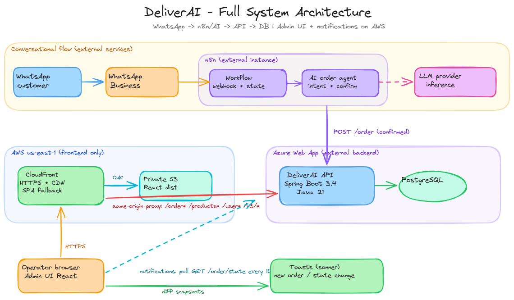
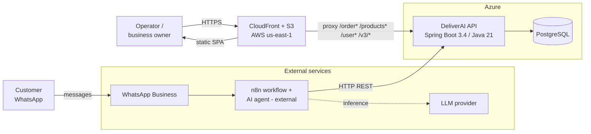
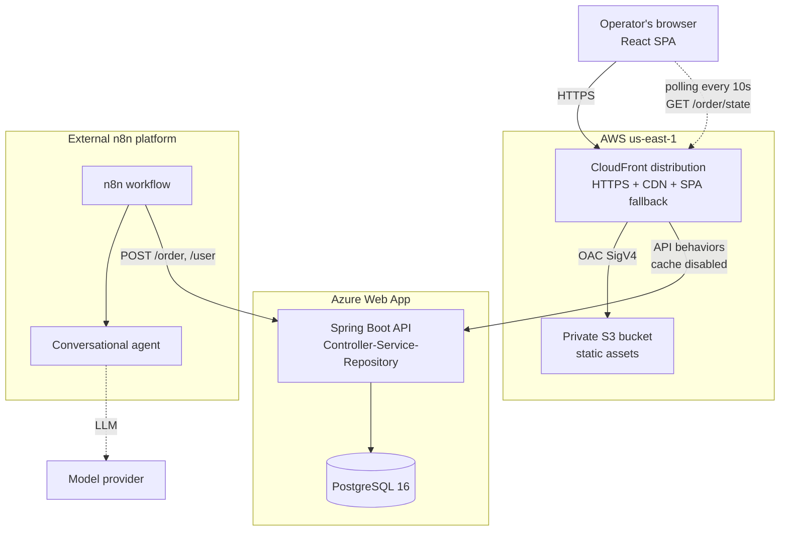
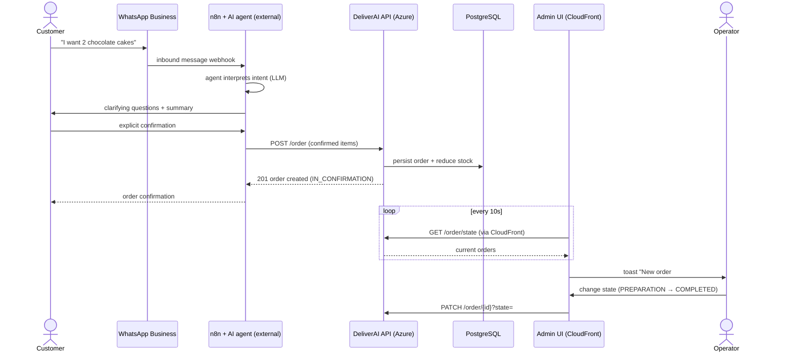
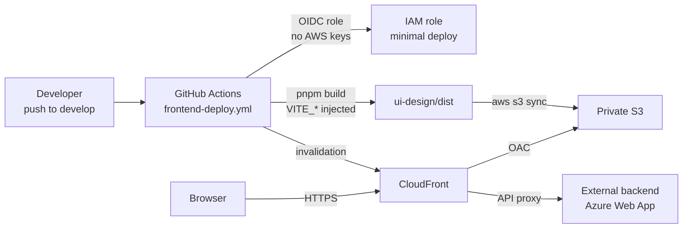
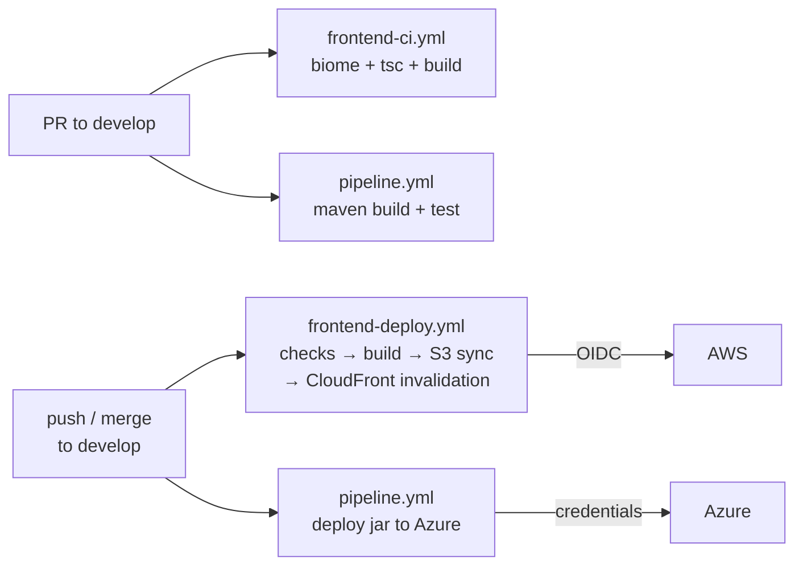

<div align="center">

# 🚀 DeliverAI


</div>

**DeliverAI** is an academic project developed for the course **Hyperautomation Architectures: Design, Implementation and Governance of AI Agents in Business Contexts** at the **Colombian School of Engineering Julio Garavito** (intersemester period 2026-I).

It automates the WhatsApp ordering flow for small and medium businesses: the customer texts the business, an AI agent orchestrated in **n8n** understands the order, confirms it and persists it through a **REST API**; the business owner manages it from the **Admin UI**.

<div align="center">



</div>

---

## 📌 Current state vs target

| Component | Status | Where it runs |
|---|---|---|
| **REST API** (Spring Boot) | ✅ Implemented in `src/` | Deployed **externally** on Azure Web App |
| **PostgreSQL** | ✅ Operational | Next to the backend (Docker Compose locally) |
| **Admin UI** (React) | ✅ Implemented in `ui-design/` | Deployed on **AWS S3 + CloudFront** |
| **Frontend infra** (Terraform) | ✅ Implemented in `infra/aws/frontend/` | Applied in AWS `us-east-1` |
| **Frontend CI/CD** | ✅ GitHub Actions + OIDC | GitHub |
| **n8n workflow + AI agent** | ⚠️ **External** — runs outside the repo; JSON export pending in `n8n/` | External n8n instance |
| **WhatsApp Business** | ⚠️ External/pending documentation in repo | Meta / external n8n |
| **Push notifications (SSE/WS)** | ❌ Pending — MVP uses REST polling | — |

> The frontend supports **mock mode** (`VITE_MOCK_DATA=true`, demo data without a backend) and **real API mode**.

---

## 🏗️ System architecture (System Context)



The **Admin UI** calls the API through CloudFront (same origin → no CORS or mixed content). The conversational flow (WhatsApp → n8n → LLM) runs **outside this repo**; its JSON export is pending in `n8n/`.

### Containers (C4 Container)



---

## 🔄 End-to-end order flow



Order states: `IN_CONFIRMATION` → `PREPARATION` → `COMPLETED`.

---

## 📦 Monorepo modules

| Path | Module | Status |
|---|---|---|
| `src/` | Spring Boot REST API (Java 21, Maven) | ✅ Complete |
| `ui-design/` | Admin UI React 19 + Vite + Tailwind 4 + shadcn/ui | ✅ Complete (MVP) |
| `infra/aws/frontend/` | Terraform: S3, CloudFront, IAM OIDC + operational scripts | ✅ Applied |
| `.github/workflows/` | Backend (Azure) and frontend (AWS) CI/CD | ✅ Active |
| `n8n/` | n8n workflow exports | ⚠️ Pending (runs externally) |
| `docker-compose.yml` | Local API + PostgreSQL | ✅ |

## ⚙️ Tech stack

| Layer | Technology | Purpose |
|---|---|---|
| Backend | Java 21, Spring Boot 3.4, Spring Data JPA/Hibernate | REST API and persistence |
| Backend | MapStruct, Lombok, Jakarta Validation, SpringDoc OpenAPI | Mapping, DTOs, docs |
| Backend | JUnit 5 + Mockito | Unit tests |
| Data | PostgreSQL 16 | Operational store |
| Frontend | React 19, Vite 8, TypeScript, Tailwind CSS 4, shadcn/ui, Biome | Admin UI |
| Automation | n8n + LLM agent *(external)* | WhatsApp conversation |
| Infra | Terraform, AWS S3 + CloudFront + IAM OIDC | Frontend static hosting |
| CI/CD | GitHub Actions | Checks + deploys |

---

## 📡 API — main endpoints

Full inventory in Swagger: `/swagger-ui.html` · OpenAPI: `/v3/api-docs`.

| Resource | Endpoints | Note |
|---|---|---|
| Products | `POST /products`, `PATCH /products/{id}/price`, `PATCH /products/{id}/units`, `DELETE /products/{id}` | ⚠️ **No list GET endpoint** (known gap) |
| Orders | `POST /order`, `GET /order/{id}`, `GET /order/user/{userId}`, `GET /order/state?state=`, `PATCH /order/{id}?state=`, `DELETE /order/{id}` | No global `GET /order`; the UI composes it with 3 per-state calls |
| Order Items | `POST /order-items`, `DELETE /order-items/{id}` | |
| Users | `POST /user`, `GET /user/{id}`, `GET /user/all`, `PUT /user/{id}`, `DELETE /user/{id}` | |

---

## ☁️ Frontend-only deploy on AWS

Only the **frontend** lives on AWS. Backend/n8n remain external.

- **Private S3**: hosts `ui-design/dist` (Vite build). No public access; CloudFront reads via Origin Access Control.
- **CloudFront**: HTTPS, global CDN, SPA fallback (403/404 → `index.html`) and **API proxy** — backend paths are routed to the external origin, avoiding CORS.
- **Vite build-time variables**: `VITE_MOCK_DATA` and `VITE_API_BASE_URL` are injected during `pnpm build` (they do not exist at runtime; see [`ui-design/README.md`](ui-design/README.md)).
- Full rationale (why not EC2/ECS/ECR, region, costs): [`infra/aws/frontend/README.md`](infra/aws/frontend/README.md).

### Deployment diagram



## 🔔 Notifications (MVP)

- **Today:** the Admin UI does **REST polling** every 10s against `GET /order/state` and shows toasts for new orders or state changes. No extra infrastructure.
- **Possible future:** SSE or WebSocket if the backend exposes them; polling would be replaced inside a single hook (`use-order-notifications.ts`).

---

## 🚀 Local quick start

### Backend + DB (Docker Compose)

```bash
docker-compose up --build
# API at http://localhost:8080 · Swagger at /swagger-ui.html
```

### Backend without Docker (in-memory H2)

```bash
mvn clean install
mvn spring-boot:run -Dspring.profiles.active=h2
```

### Frontend

```bash
cd ui-design
pnpm install
pnpm dev          # http://localhost:5173 (mock mode by default)
```

Real API mode and other frontend operations: [`ui-design/README.md`](ui-design/README.md).

### Backend tests

```bash
mvn test
```

---

## 🔁 CI/CD



| Workflow | Trigger | Does |
|---|---|---|
| `pipeline.yml` | PR/push `main`/`develop` | Maven build, tests, deploy jar to Azure Web App |
| `frontend-ci.yml` | PR to `develop` (frontend paths) | `pnpm check` + `type-check` + `build` — no AWS |
| `frontend-deploy.yml` | Push to `develop` / manual | Checks → real build → OIDC → S3 sync → invalidation |

---

## ⚠️ Known risks and gaps

| Gap | Impact | Mitigation |
|---|---|---|
| No `GET /products` (list) | Agent/UI cannot list the catalog from the API | UI surfaces the gap; endpoint pending in backend |
| `OrderRequestDTO` lacks `userId` | Orders end up with no associated user | Documented; requires backend DTO change |
| n8n export not versioned in repo | Workflow not reproducible from the repo | `n8n/` reserved; JSON export pending |
| Global SPA fallback 403/404 | A real backend 403/404 through CloudFront returns `index.html` 200 | Documented in `infra/aws/frontend/main.tf` |
| 10s polling | Notification latency up to 10s + light API load | Acceptable for MVP; SSE/WS in the future |
| Local Terraform state | One infra operator at a time | Remote backend (S3 + lock) if the team grows |

---

## 📐 Visual diagram

- Image: [`media/architecture-diagram.png`](media/architecture-diagram.png) (embedded at the top of this README).
- Editable source: [`docs/architecture/deliverai-system-architecture.excalidraw`](docs/architecture/deliverai-system-architecture.excalidraw) (open at [excalidraw.com](https://excalidraw.com) → File → Open).

---

## 🙌 Team

- [Tulio Riaño Sánchez](https://github.com/tulio3101)
- [Julian Camilo Lopez Barrero](https://github.com/JulianLopez11)
- [Sergio Andrey Silva Rodriguez](https://github.com/OneCode182)
- [David Alejandro Patacon Henao](https://github.com/AlejandroHenao2572)
- [Manuel Alejandro Guarnizo](https://github.com/MAGG0059)

## 📄 License

Licensed under the **MIT License** — see [LICENSE](LICENSE).
