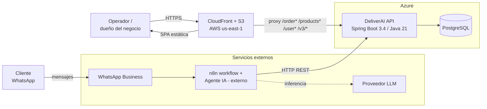
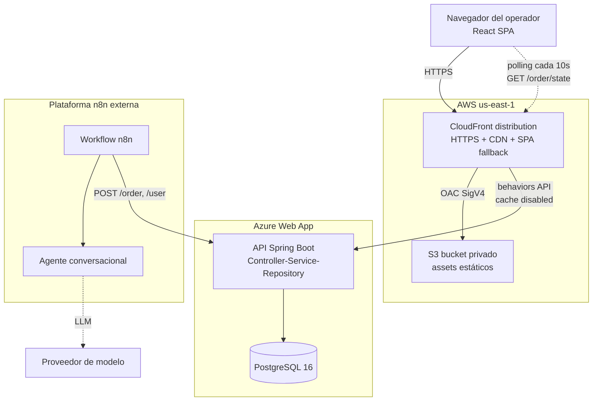
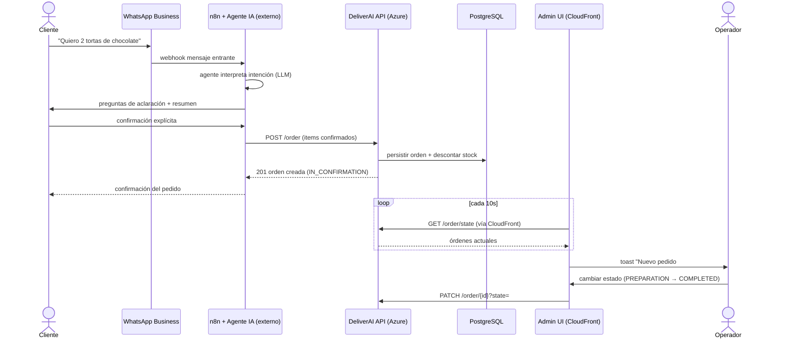
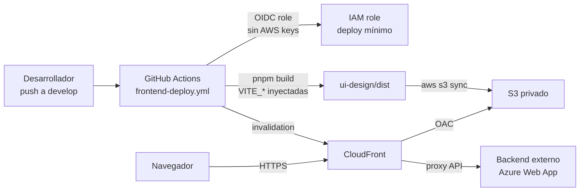
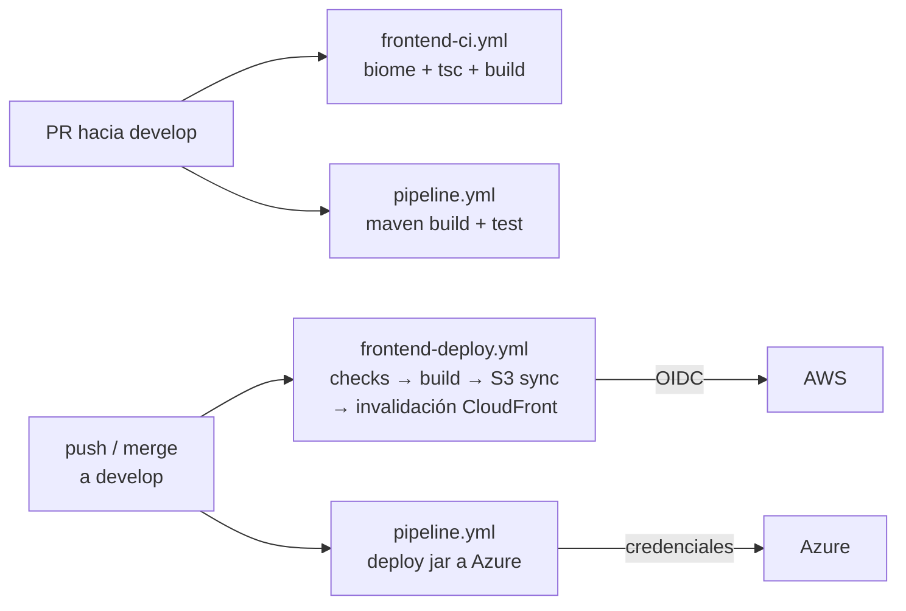

<div align="center">

# 🚀 DeliverAI


</div>

**DeliverAI** es un proyecto académico del curso **Arquitecturas de Hiperautomatización: Diseño, Implementación y Gobierno de Agentes de IA en Contextos Empresariales** de la **Escuela Colombiana de Ingeniería Julio Garavito** (intersemestral 2026-I).

Automatiza el flujo de pedidos por WhatsApp para pequeños y medianos negocios: el cliente escribe al negocio, un agente de IA orquestado en **n8n** entiende el pedido, lo confirma y lo persiste vía **API REST**; el dueño del negocio lo gestiona desde el **Admin UI**.

```
Cliente (WhatsApp) → n8n (Agente IA) → REST API → PostgreSQL
                                            ↑
                              Admin UI (React) — operador
```

---

## 📌 Estado actual vs objetivo

| Componente | Estado | Dónde corre |
|---|---|---|
| **REST API** (Spring Boot) | ✅ Implementada en `src/` | Desplegada **externa** en Azure Web App |
| **PostgreSQL** | ✅ Operativa | Junto al backend (Docker Compose en local) |
| **Admin UI** (React) | ✅ Implementada en `ui-design/` | Desplegada en **AWS S3 + CloudFront** |
| **Infra frontend** (Terraform) | ✅ Implementada en `infra/aws/frontend/` | Aplicada en AWS `us-east-1` |
| **CI/CD frontend** | ✅ GitHub Actions + OIDC | GitHub |
| **n8n workflow + agente IA** | ⚠️ **Externo** — corre fuera del repo; export JSON pendiente en `n8n/` | Instancia n8n externa |
| **WhatsApp Business** | ⚠️ Externo/pendiente de documentar en repo | Meta / n8n externo |
| **Notificaciones push (SSE/WS)** | ❌ Pendiente — MVP usa polling REST | — |

> El frontend soporta **modo mock** (`VITE_MOCK_DATA=true`, datos demo sin backend) y **modo API real**.

---

## 🏗️ Arquitectura general (System Context)



El **Admin UI** llama a la API a través de CloudFront (mismo origen → sin CORS ni mixed-content). El flujo conversacional (WhatsApp → n8n → LLM) corre **fuera de este repo**; su export JSON está pendiente en `n8n/`.

### Contenedores (C4 Container)



---

## 🔄 Flujo de órdenes end-to-end



Estados de orden: `IN_CONFIRMATION` → `PREPARATION` → `COMPLETED`.

---

## 📦 Módulos del monorepo

| Ruta | Módulo | Estado |
|---|---|---|
| `src/` | REST API Spring Boot (Java 21, Maven) | ✅ Completa |
| `ui-design/` | Admin UI React 19 + Vite + Tailwind 4 + shadcn/ui | ✅ Completa (MVP) |
| `infra/aws/frontend/` | Terraform: S3, CloudFront, IAM OIDC + scripts operativos | ✅ Aplicada |
| `.github/workflows/` | CI/CD backend (Azure) y frontend (AWS) | ✅ Activos |
| `n8n/` | Export de workflows n8n | ⚠️ Pendiente (corre externo) |
| `docker-compose.yml` | API + PostgreSQL local | ✅ |

## ⚙️ Tecnologías

| Capa | Tecnología | Uso |
|---|---|---|
| Backend | Java 21, Spring Boot 3.4, Spring Data JPA/Hibernate | API REST y persistencia |
| Backend | MapStruct, Lombok, Jakarta Validation, SpringDoc OpenAPI | Mapping, DTOs, docs |
| Backend | JUnit 5 + Mockito | Tests unitarios |
| Datos | PostgreSQL 16 | Almacén operacional |
| Frontend | React 19, Vite 8, TypeScript, Tailwind CSS 4, shadcn/ui, Biome | Admin UI |
| Automatización | n8n + agente LLM *(externo)* | Conversación WhatsApp |
| Infra | Terraform, AWS S3 + CloudFront + IAM OIDC | Hosting estático frontend |
| CI/CD | GitHub Actions | Checks + deploys |

---

## 📡 API — endpoints principales

Inventario completo en Swagger: `/swagger-ui.html` · OpenAPI: `/v3/api-docs`.

| Recurso | Endpoints | Nota |
|---|---|---|
| Products | `POST /products`, `PATCH /products/{id}/price`, `PATCH /products/{id}/units`, `DELETE /products/{id}` | ⚠️ **No existe GET de listado** (gap conocido) |
| Orders | `POST /order`, `GET /order/{id}`, `GET /order/user/{userId}`, `GET /order/state?state=`, `PATCH /order/{id}?state=`, `DELETE /order/{id}` | Sin `GET /order` global; el UI compone con 3 llamadas por estado |
| Order Items | `POST /order-items`, `DELETE /order-items/{id}` | |
| Users | `POST /user`, `GET /user/{id}`, `GET /user/all`, `PUT /user/{id}`, `DELETE /user/{id}` | |

---

## ☁️ Deploy frontend-only en AWS

Solo el **frontend** vive en AWS. Backend/n8n permanecen externos.

- **S3 privado**: aloja `ui-design/dist` (build Vite). Sin acceso público; CloudFront lee vía Origin Access Control.
- **CloudFront**: HTTPS, CDN global, fallback SPA (403/404 → `index.html`) y **proxy de API** — los paths del backend se enrutan al origin externo, evitando CORS.
- **Variables build-time de Vite**: `VITE_MOCK_DATA` y `VITE_API_BASE_URL` se inyectan durante `pnpm build` (no existen en runtime; ver [`ui-design/README.md`](ui-design/README.md)).
- Justificación completa (por qué no EC2/ECS/ECR, región, costos): [`infra/aws/frontend/README.md`](infra/aws/frontend/README.md).

### Diagrama de deployment



## 🔔 Notificaciones (MVP)

- **Hoy:** el Admin UI hace **polling REST** cada 10s a `GET /order/state` y muestra toasts ante pedidos nuevos o cambios de estado. Sin infraestructura adicional.
- **Futuro posible:** SSE o WebSocket si el backend los expone; el polling se reemplazaría en un solo hook (`use-order-notifications.ts`).

---

## 🚀 Guía rápida local

### Backend + DB (Docker Compose)

```bash
docker-compose up --build
# API en http://localhost:8080 · Swagger en /swagger-ui.html
```

### Backend sin Docker (H2 en memoria)

```bash
mvn clean install
mvn spring-boot:run -Dspring.profiles.active=h2
```

### Frontend

```bash
cd ui-design
pnpm install
pnpm dev          # http://localhost:5173 (modo mock por defecto)
```

Modo API real y demás operación del frontend: [`ui-design/README.md`](ui-design/README.md).

### Tests backend

```bash
mvn test
```

---

## 🔁 CI/CD



| Workflow | Trigger | Hace |
|---|---|---|
| `pipeline.yml` | PR/push `main`/`develop` | Build Maven, tests, deploy jar a Azure Web App |
| `frontend-ci.yml` | PR a `develop` (paths frontend) | `pnpm check` + `type-check` + `build` — sin AWS |
| `frontend-deploy.yml` | Push a `develop` / manual | Checks → build real → OIDC → S3 sync → invalidación |

---

## ⚠️ Riesgos y gaps conocidos

| Gap | Impacto | Mitigación |
|---|---|---|
| No existe `GET /products` (listado) | Agente/UI no pueden listar catálogo desde API | UI muestra el gap; endpoint pendiente en backend |
| `OrderRequestDTO` sin `userId` | Órdenes quedan sin usuario asociado | Documentado; requiere cambio de DTO backend |
| Export n8n no versionado en repo | Workflow no reproducible desde el repo | `n8n/` reservado; exportar JSON pendiente |
| Fallback SPA global 403/404 | Un 403/404 real del backend vía CloudFront devuelve `index.html` 200 | Documentado en `infra/aws/frontend/main.tf` |
| Polling 10s | Latencia de notificación hasta 10s + carga ligera en API | Aceptable para MVP; SSE/WS futuro |
| Estado Terraform local | Un solo operador de infra a la vez | Backend remoto (S3 + lock) si el equipo crece |

---

## 📐 Diagrama visual

Diagrama editable de arquitectura general: [`docs/architecture/deliverai-system-architecture.excalidraw`](docs/architecture/deliverai-system-architecture.excalidraw) (abrir en [excalidraw.com](https://excalidraw.com) → File → Open).

---

## 🙌 Equipo

- [Tulio Riaño Sánchez](https://github.com/tulio3101)
- [Julian Camilo Lopez Barrero](https://github.com/JulianLopez11)
- [Sergio Andrey Silva Rodriguez](https://github.com/OneCode182)
- [David Alejandro Patacon Henao](https://github.com/AlejandroHenao2572)
- [Manuel Alejandro Guarnizo](https://github.com/MAGG0059)

## 📄 Licencia

Proyecto bajo **MIT License** — ver [LICENSE](LICENSE).
