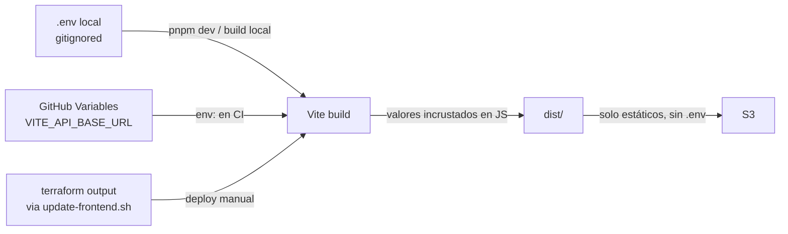
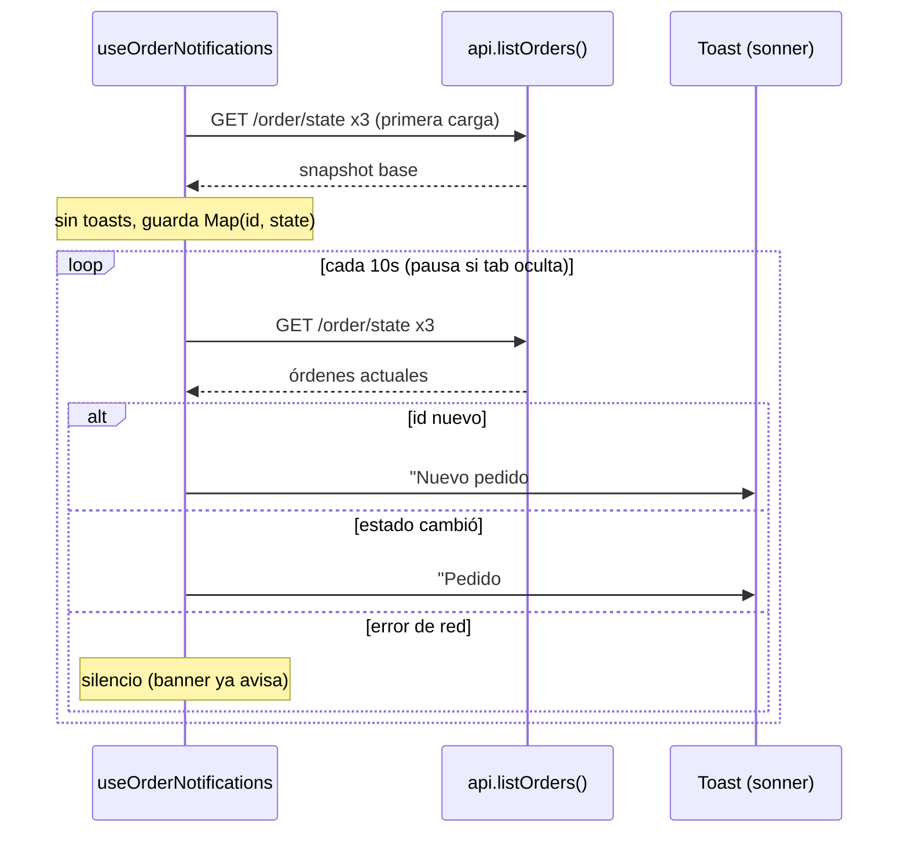
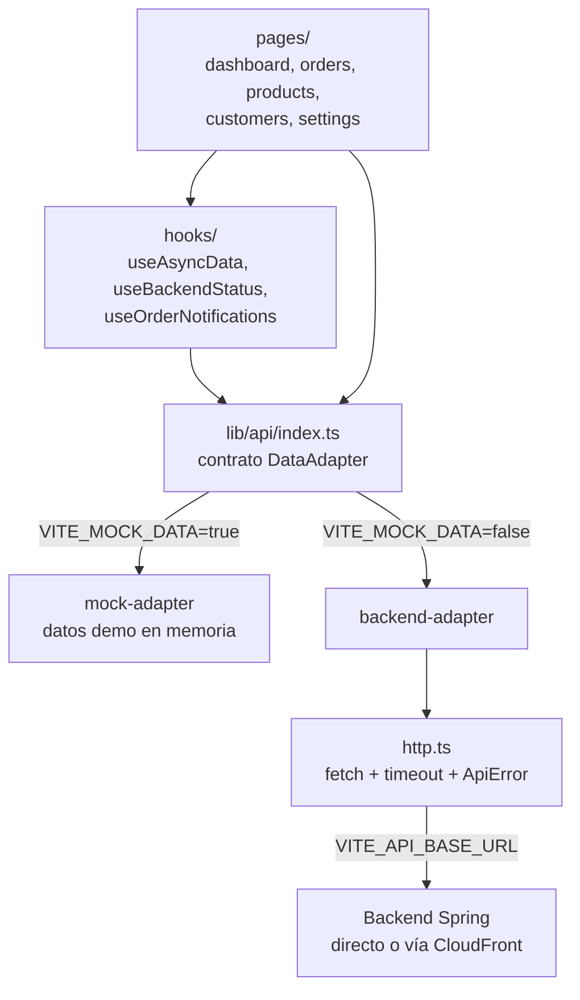

# DeliverAI Admin UI

Admin UI operacional (MVP) para DeliverAI: revisión de pedidos, estados, clientes y catálogo de productos. Construida con React + Vite + TypeScript + Tailwind CSS v4 + shadcn/ui + Biome. Estética liquid/glass tipo macOS/iOS.

## Requisitos

- Node.js 20+
- pnpm recomendado. Si no está activo, ejecutar:

```bash
corepack enable
corepack prepare pnpm@latest --activate
```

- Backend opcional: Spring Boot en `http://localhost:8080` (ver raíz del repo, `docker-compose.yml`).

## Arranque con pnpm

Trabajar siempre desde el root del frontend:

```bash
cd /home/onecode/ECI/DeliverAI/ui-design
```

Instalar dependencias:

```bash
pnpm install
```

Levantar dev server:

```bash
pnpm dev
```

Si el puerto `5173` está ocupado:

```bash
pnpm dev -- --host 127.0.0.1 --port 5174
```

## Linting, formato y build

Biome check completo:

```bash
pnpm check
```

Biome lint:

```bash
pnpm lint
```

Biome auto-fix:

```bash
pnpm check:fix
```

Formato:

```bash
pnpm format
```

TypeScript y build:

```bash
pnpm type-check
pnpm build
```

Servir build:

```bash
pnpm preview
```

## Variables de entorno

Copiar `.env.example` a `.env`:

| Variable | Default | Uso |
|---|---|---|
| `VITE_MOCK_DATA` | `true` | `true`: datos demo locales. `false`: API real. |
| `VITE_API_BASE_URL` | `http://localhost:8080` | Base URL del backend Spring. |
| `MOCK_DATA` | `true` | **Alias operativo/documental** del mismo concepto. |

> **Nota `MOCK_DATA` vs `VITE_MOCK_DATA`:** Vite solo expone al cliente variables con prefijo `VITE_`. Por eso el código lee **`VITE_MOCK_DATA`**. `MOCK_DATA` se mantiene en `.env` porque fue pedido explícitamente como flag operativo, pero no es visible para la app en el navegador. Cambios en `.env` requieren reiniciar el dev server.

### Variables en build-time (clave para el deploy)

**El `.env` nunca se sube a S3.** Las variables `VITE_*` se **incrustan como texto en el bundle JS durante `pnpm build`** — no existen en runtime ni hay servidor que las lea. Cambiar una variable del deploy exige rebuild + redeploy.



- **Modo real (deploy):** `VITE_MOCK_DATA=false` + `VITE_API_BASE_URL=<url-backend-o-cloudfront>` (en producción se usa la URL de CloudFront: la API va proxyada por el mismo dominio).
- **Modo mock/demo:** `VITE_MOCK_DATA=true` — no requiere backend.

## Modos de datos

- **`VITE_MOCK_DATA=true` (demo):** adapter mock en memoria con datos realistas etiquetados como demo en la UI (badge/banner "Datos demo").
- **`VITE_MOCK_DATA=false` (API real):** adapter contra el backend Spring. Detecta backend caído/timeout/errores HTTP y muestra banner de degradación + toasts sin romper la UI. Health check: `GET /v3/api-docs` cada 15s.

**Notificaciones de pedidos (polling):** la UI sondea `GET /order/state` (vía `api.listOrders()`) cada 10s y muestra toasts ante pedidos nuevos o cambios de estado. Solo REST polling — el backend no expone SSE/WebSocket. Primera carga silenciosa; errores de polling se silencian (el banner de estado ya cubre backend offline).



## Endpoints backend usados

Según `Agents/project/api-inventory.md`:

- Products: `POST /products`, `PATCH /products/{id}/price`, `PATCH /products/{id}/units`, `DELETE /products/{id}`
- Orders: `POST /order`, `PATCH /order/{id}?state=`, `DELETE /order/{id}`, `GET /order/{id}`, `GET /order/user/{userId}`, `GET /order/state?state=`
- Users: `POST /user`, `GET /user/{id}`, `GET /user/all`, `PUT /user/{id}`, `DELETE /user/{id}`
- Health: `GET /v3/api-docs`

## Gaps conocidos del backend (reflejados en UI)

- **No existe `GET /products` (listado).** En modo API real, la vista Productos muestra el gap explícitamente; las mutaciones (crear/actualizar/eliminar) sí operan contra la API.
- El listado global de pedidos se compone con 3 llamadas a `GET /order/state` (no hay `GET /order` global).
- `OrderRequestDTO` no expone `userId`: los pedidos creados desde la UI quedan sin usuario asociado (limitación del backend).
- n8n/WhatsApp no implementado (fuera del alcance del frontend).

## Deploy en AWS (S3 + CloudFront)

El frontend se despliega como sitio estático en AWS: S3 privado + CloudFront (HTTPS, CDN, fallback SPA y proxy de API hacia el backend externo). La infraestructura, scripts y guía completa (auth, variables, rollback, teardown) viven en [`infra/aws/frontend/README.md`](../infra/aws/frontend/README.md).

- **CI (PRs a `develop`):** `.github/workflows/frontend-ci.yml` corre `pnpm check`, `pnpm type-check` y `pnpm build`.
- **Deploy (push a `develop` o manual):** `.github/workflows/frontend-deploy.yml` construye con `VITE_MOCK_DATA=false` y `VITE_API_BASE_URL` (GitHub Variable), sincroniza `dist/` a S3 vía OIDC (sin AWS keys) e invalida CloudFront.
- **Deploy manual local:** `infra/aws/frontend/scripts/update-frontend.sh`.


## Docker (paridad local/demo)

Imagen opcional multi-stage (build pnpm → Nginx sirviendo `dist/` con fallback SPA). **No** es el path de deploy en AWS; sirve para demos locales y validación en CI.

```bash
docker build -t deliverai-frontend \
  --build-arg VITE_MOCK_DATA=true \
  --build-arg VITE_API_BASE_URL=http://localhost:8080 \
  ui-design
docker run --rm -p 8081:80 deliverai-frontend
```

## Arquitectura frontend



```
src/
  lib/
    config.ts          # env central (VITE_*)
    types.ts           # tipos alineados a DTOs del backend
    format.ts          # formateadores es-CO
    mock-data.ts       # datos demo
    api/
      data-adapter.ts  # contrato DataAdapter (única interfaz de datos de la UI)
      http.ts          # fetch con timeout + ApiError tipado
      backend-adapter.ts
      mock-adapter.ts
      index.ts         # selección de adapter por VITE_MOCK_DATA
  hooks/               # useAsyncData, useBackendStatus, useOrderNotifications
  components/
    ui/                # shadcn/ui (generado)
    layout/            # shell: sidebar, header, banners, tema
  pages/               # dashboard, orders, products, customers, settings
```

Regla: los componentes de página nunca hacen `fetch` directo; todo pasa por `api` (`src/lib/api`).

## Troubleshooting

| Síntoma | Causa probable | Solución |
|---|---|---|
| Errores **CORS** en consola | La app llama al backend en otro dominio directamente | Usar la URL de CloudFront como `VITE_API_BASE_URL` (API proxyada = mismo origen) o habilitar el origen en `CorsConfig` del backend |
| **Mixed content** bloqueado | Página HTTPS llamando API `http://` | `VITE_API_BASE_URL` siempre `https://` en deploy; CloudFront ya fuerza HTTPS |
| Banner "backend offline" permanente | API caída, URL errónea en build, o cold start de Azure (free tier tarda ~20-60s) | Probar `curl <url>/v3/api-docs`; verificar la variable con la que se hizo el build; reintentar tras el cold start |
| **404 al refrescar** una ruta (`/orders`) | Falta fallback SPA | Ya cubierto: CloudFront 403/404→`index.html` y Nginx `try_files`; si aparece, revisar `custom_error_response` en Terraform |
| Deploy hecho pero se ve **versión vieja** | Cache CloudFront/navegador | Verificar que corrió `create-invalidation /*`; hard-refresh (Ctrl+Shift+R). `index.html` no se cachea; los assets van con hash |
| Cambié una variable y "no aplica" | `VITE_*` es build-time | Rebuild + redeploy (workflow o `update-frontend.sh`); en dev, reiniciar `pnpm dev` |
| Productos no listan en modo API | Gap real del backend (`GET /products` no existe) | No es bug del frontend; ver tabla de gaps |
