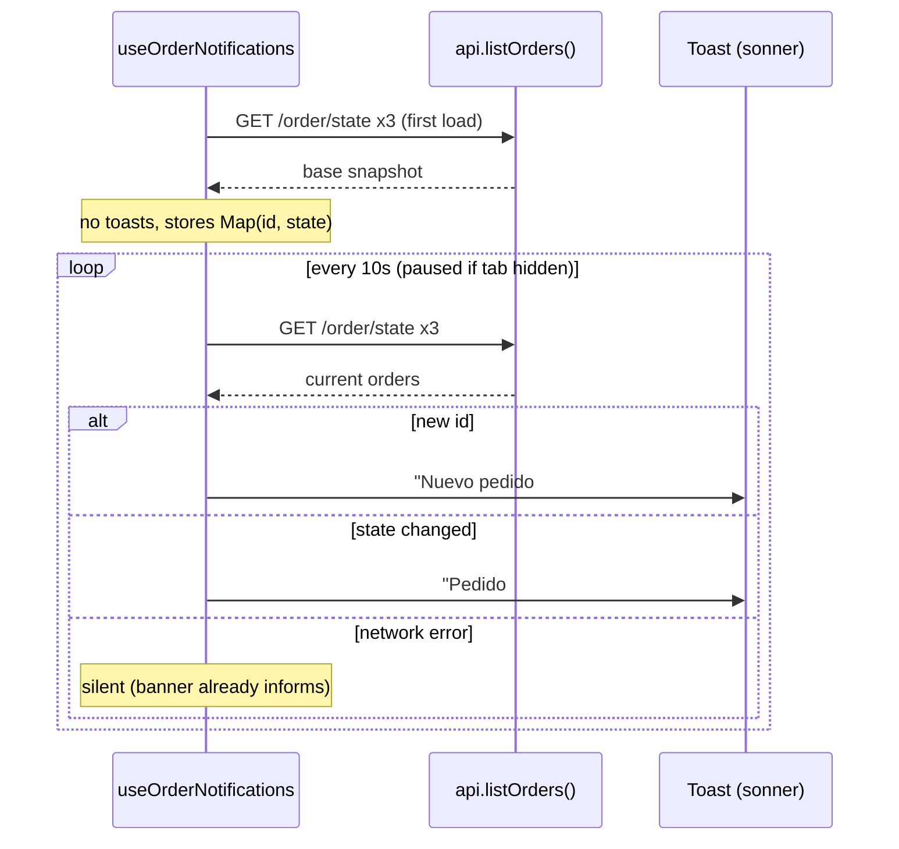
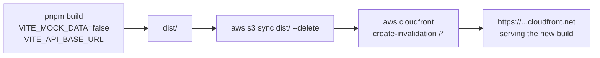
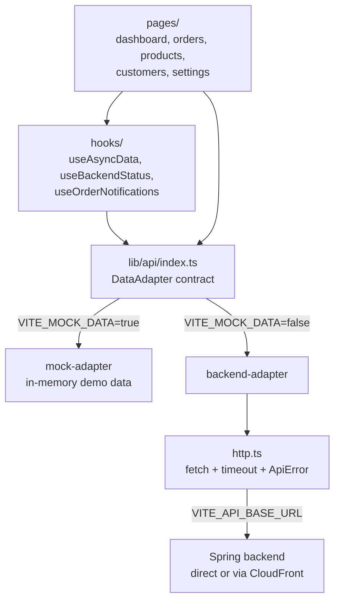

# DeliverAI Admin UI

Operational Admin UI (MVP) for DeliverAI: order review, states, customers and product catalog. Built with React + Vite + TypeScript + Tailwind CSS v4 + shadcn/ui + Biome. macOS/iOS-style liquid/glass aesthetic.

## Requirements

- Node.js 20+
- pnpm recommended. If not active, run:

```bash
corepack enable
corepack prepare pnpm@latest --activate
```

- Optional backend: Spring Boot at `http://localhost:8080` (see repo root, `docker-compose.yml`).

## Getting started with pnpm

Always work from the frontend root:

```bash
cd /home/onecode/ECI/DeliverAI/ui-design
```

Install dependencies:

```bash
pnpm install
```

Start the dev server:

```bash
pnpm dev
```

If port `5173` is busy:

```bash
pnpm dev -- --host 127.0.0.1 --port 5174
```

## Linting, formatting and build

Full Biome check:

```bash
pnpm check
```

Biome lint:

```bash
pnpm lint
```

Biome auto-fix:

```bash
pnpm check:fix
```

Format:

```bash
pnpm format
```

TypeScript and build:

```bash
pnpm type-check
pnpm build
```

Serve the build:

```bash
pnpm preview
```

## Environment variables

Copy `.env.example` to `.env`:

| Variable | Default | Purpose |
|---|---|---|
| `VITE_MOCK_DATA` | `true` | `true`: local demo data. `false`: real API. |
| `VITE_API_BASE_URL` | `http://localhost:8080` | Spring backend base URL. |
| `MOCK_DATA` | `true` | **Operational/documentation alias** of the same concept. |

> **`MOCK_DATA` vs `VITE_MOCK_DATA` note:** Vite only exposes variables prefixed with `VITE_` to the client. That is why the code reads **`VITE_MOCK_DATA`**. `MOCK_DATA` is kept in `.env` because it was explicitly requested as an operational flag, but it is not visible to the app in the browser. Changes to `.env` require restarting the dev server.

### Build-time variables (key for deploys)

**The `.env` file is never uploaded to S3.** `VITE_*` variables are **inlined as text into the JS bundle during `pnpm build`** — they do not exist at runtime and there is no server reading them. Changing a deploy variable requires rebuild + redeploy.


- **Real mode (deploy):** `VITE_MOCK_DATA=false` + `VITE_API_BASE_URL=<backend-or-cloudfront-url>` (production uses the CloudFront URL: the API is proxied through the same domain).
- **Mock/demo mode:** `VITE_MOCK_DATA=true` — no backend required.

## Data modes

- **`VITE_MOCK_DATA=true` (demo):** in-memory mock adapter with realistic data labeled as demo in the UI ("Datos demo" badge/banner).
- **`VITE_MOCK_DATA=false` (real API):** adapter against the real Spring backend. Detects backend down/timeout/HTTP errors and shows a degradation banner + toasts without breaking the UI. Health check: `GET /v3/api-docs` every 15s.

**Order notifications (polling):** the UI polls `GET /order/state` (via `api.listOrders()`) every 10s and shows toasts for new orders or state changes. REST polling only — the backend does not expose SSE/WebSocket. First load is silent; polling errors are silenced (the status banner already covers backend offline).



## Backend endpoints used

Per `Agents/project/api-inventory.md`:

- Products: `POST /products`, `PATCH /products/{id}/price`, `PATCH /products/{id}/units`, `DELETE /products/{id}`
- Orders: `POST /order`, `PATCH /order/{id}?state=`, `DELETE /order/{id}`, `GET /order/{id}`, `GET /order/user/{userId}`, `GET /order/state?state=`
- Users: `POST /user`, `GET /user/{id}`, `GET /user/all`, `PUT /user/{id}`, `DELETE /user/{id}`
- Health: `GET /v3/api-docs`

## Known backend gaps (surfaced in the UI)

- **No `GET /products` (list) exists.** In real API mode, the Products view surfaces the gap explicitly; mutations (create/update/delete) do work against the API.
- The global order list is composed from 3 calls to `GET /order/state` (there is no global `GET /order`).
- `OrderRequestDTO` does not expose `userId`: orders created from the UI end up with no associated user (backend limitation).
- n8n/WhatsApp not implemented (out of the frontend's scope).

## AWS deploy (S3 + CloudFront)

The frontend deploys as a static site on AWS: private S3 + CloudFront (HTTPS, CDN, SPA fallback and API proxy to the external backend). Infrastructure, scripts and the full guide (auth, variables, rollback, teardown) live in [`infra/aws/frontend/README.md`](../infra/aws/frontend/README.md).

- **CI (PRs to `develop`):** `.github/workflows/frontend-ci.yml` runs `pnpm check`, `pnpm type-check` and `pnpm build`.
- **Deploy (push to `develop` or manual):** `.github/workflows/frontend-deploy.yml` builds with `VITE_MOCK_DATA=false` and `VITE_API_BASE_URL` (GitHub Variable), syncs `dist/` to S3 via OIDC (no AWS keys) and invalidates CloudFront.
- **Manual local deploy:** `infra/aws/frontend/scripts/update-frontend.sh`.



## Docker (local/demo parity)

Optional multi-stage image (pnpm build → Nginx serving `dist/` with SPA fallback). **Not** the AWS deploy path; useful for local demos and CI validation.

```bash
docker build -t deliverai-frontend \
  --build-arg VITE_MOCK_DATA=true \
  --build-arg VITE_API_BASE_URL=http://localhost:8080 \
  ui-design
docker run --rm -p 8081:80 deliverai-frontend
```

## Frontend architecture



```
src/
  lib/
    config.ts          # central env (VITE_*)
    types.ts           # types aligned with backend DTOs
    format.ts          # es-CO formatters
    mock-data.ts       # demo data
    api/
      data-adapter.ts  # DataAdapter contract (the UI's single data interface)
      http.ts          # fetch with timeout + typed ApiError
      backend-adapter.ts
      mock-adapter.ts
      index.ts         # adapter selection by VITE_MOCK_DATA
  hooks/               # useAsyncData, useBackendStatus, useOrderNotifications
  components/
    ui/                # shadcn/ui (generated)
    layout/            # shell: sidebar, header, banners, theme
  pages/               # dashboard, orders, products, customers, settings
```

Rule: page components never `fetch` directly; everything goes through `api` (`src/lib/api`).

## Troubleshooting

| Symptom | Likely cause | Fix |
|---|---|---|
| **CORS** errors in console | The app calls the backend on another domain directly | Use the CloudFront URL as `VITE_API_BASE_URL` (proxied API = same origin) or allow the origin in the backend's `CorsConfig` |
| **Mixed content** blocked | HTTPS page calling an `http://` API | `VITE_API_BASE_URL` must always be `https://` in deploys; CloudFront already forces HTTPS |
| Permanent "backend offline" banner | API down, wrong URL baked into the build, or Azure cold start (free tier takes ~20-60s) | Try `curl <url>/v3/api-docs`; verify the variable the build used; retry after the cold start |
| **404 on refresh** of a route (`/orders`) | Missing SPA fallback | Already covered: CloudFront 403/404→`index.html` and Nginx `try_files`; if it shows up, check `custom_error_response` in Terraform |
| Deploy done but **old version** shows | CloudFront/browser cache | Check that `create-invalidation /*` ran; hard-refresh (Ctrl+Shift+R). `index.html` is not cached; assets are hash-named |
| Changed a variable and "nothing happens" | `VITE_*` is build-time | Rebuild + redeploy (workflow or `update-frontend.sh`); in dev, restart `pnpm dev` |
| Products don't list in API mode | Real backend gap (`GET /products` does not exist) | Not a frontend bug; see the gaps table |

> UI-facing texts (state labels, toasts like "Nuevo pedido #id") remain in Spanish on purpose: the product's end users are Spanish-speaking operators.
